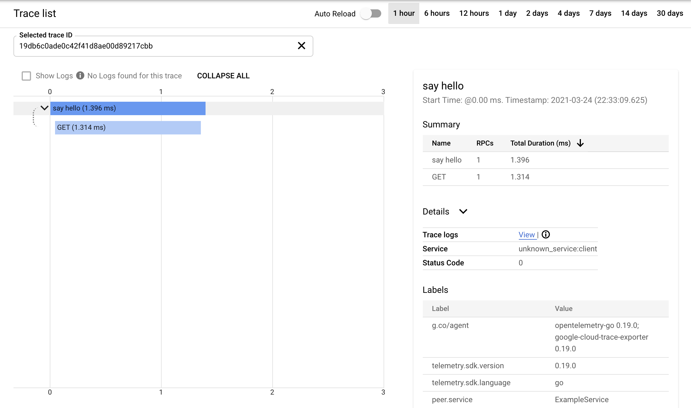

# HTTP Client-Server example

An HTTP server and client instrumented to send traces to Google Cloud Trace.

In order to run this example, you'll need to

1. [Create a GCP project](https://cloud.google.com/resource-manager/docs/creating-managing-projects)
2. [Enable billing](https://cloud.google.com/billing/docs/how-to/manage-billing-account#new-billing)
3. [Enable the Cloud Trace API](https://console.cloud.google.com/apis/library/cloudtrace.googleapis.com)
4. Obtain authentication credentials
    * If you run the code on GCE/GKE/Cloud Run, it will receive the necessary authentication credentials automatically.
    * If you run in Cloud Shell or outside of GCP, you'll need to have it [authenticate as a service account](https://cloud.google.com/docs/authentication/production).
5. In one terminal, run the server
    ```
    $ go run ./server
    ```
6. In another terminal on the same host, run the client
    ```
    $ go run ./client
    ```
7. Open [Google Cloud Trace](https://console.cloud.google.com/traces/list) and examine the trace that was recorded.
    
